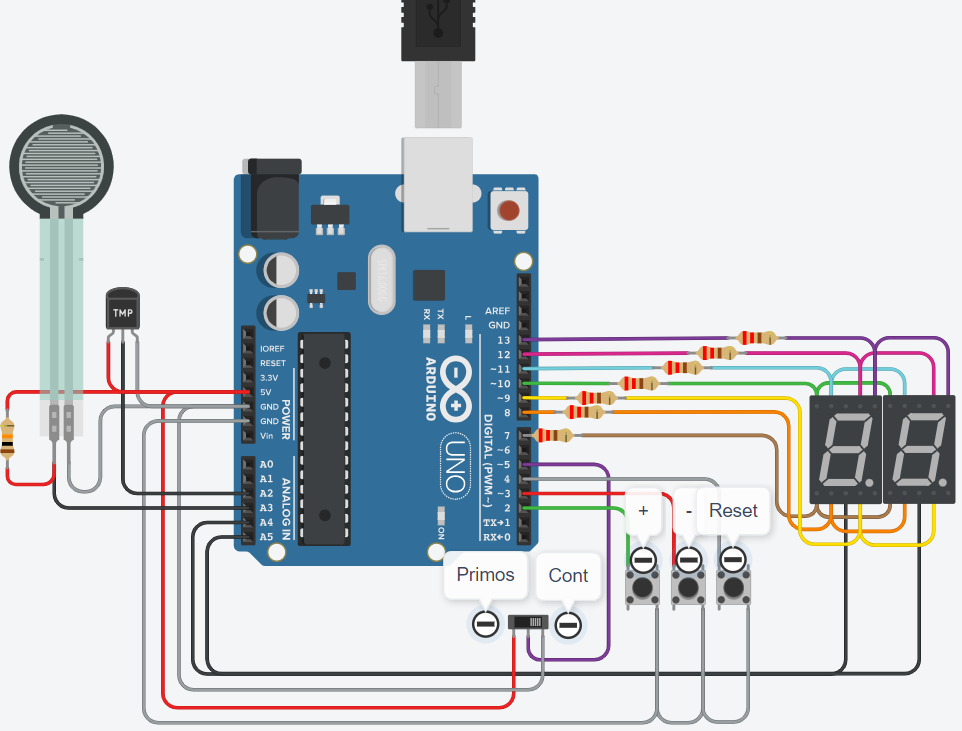

# SPD - TP1

## Integrantes 
- Nicolas Peralta
- Hernan Nieva

## Proyecto: Contador binario.

## Descripción
En este proyecto se implementa un contador binario haciendo uso de dos displays de 7 segmentos.
Se usa la técnica de multiplexado para no necesitar más pines de los que ofrece Arduino.

## Loop principal
El loop standard de arduino recibe las distintas pulsaciones a partir de la función teclaPresionada().
En base a la recepción de este valor, aumenta, disminuye, o resetea la cuenta, que luego es impresa por la función controladorDisplay():

~~~ C++
void loop()
{      
  // Ejecucion del antirrebote
  int presionoTecla = teclaPresionada();

  // Acción sobre el pulsador en base a tecla presionada
  if(presionoTecla == SUBE)
  {
  	contadorNumeros += 1;
   
    if(contadorNumeros > 99)
    {
      contadorNumeros = 0;
    }
  }
  else if(presionoTecla == BAJA)
  {
    contadorNumeros -= 1;

    if(contadorNumeros < 0)
    {
      contadorNumeros = 99;
    }
  }
  else if(presionoTecla == RESET)
  {
     contadorNumeros = 0;
  }
  
  // Llamamos a la funcion para el manejo de los display
  controladorDisplay(contadorNumeros);
}
~~~

~~~ C++
La función teclaPresionada() está hecha de tal forma que se evite el rebote del pulsador, es decir, que el mantener apretado el botón no se detecte como varias pulsaciones seguidas.
Se verifica el estado anterior del pulsador para sólo devolver cuando estuvo presionado y dejó de estarlo:

int teclaPresionada(void)
{
  // Función para detectar la pulsación de botones y gestionar el antirrebote.
  // Devuelve SUBE, BAJA o RESET en caso de pulsación o 0 en caso contrario.
  leerReiniciar = digitalRead(RESET);
  leerSumar = digitalRead(SUBE);
  leerRestar = digitalRead(BAJA);
  
  if(leerSumar == 1)
  {
    sumarAnterior = 1;
  }
  
  if(leerRestar  == 1)
  {
    restarAnterior = 1;
  }

  if(leerReiniciar  == 1)
  {
    reiniciarAnterior = 1;
  }
  
  // ANTIRREBOTE 
  if(leerSumar == 0 && leerSumar != sumarAnterior)
  {
  	sumarAnterior = leerSumar;
    return SUBE;
  }
  
  if(leerRestar == 0 && leerRestar != restarAnterior)
  {
  	restarAnterior = leerRestar;
    return BAJA;
  }
  
  if(leerReiniciar == 0 && leerReiniciar != reiniciarAnterior)
  {
  	reiniciarAnterior = leerReiniciar;
    return RESET;
  }

  // Devuelve 0 en caso de que no pase nada de lo anterior
  return 0;
}
~~~

## :robot: Link al proyecto en Tinkercad
- [proyecto](https://www.tinkercad.com/things/3Hq4TQANRCd)